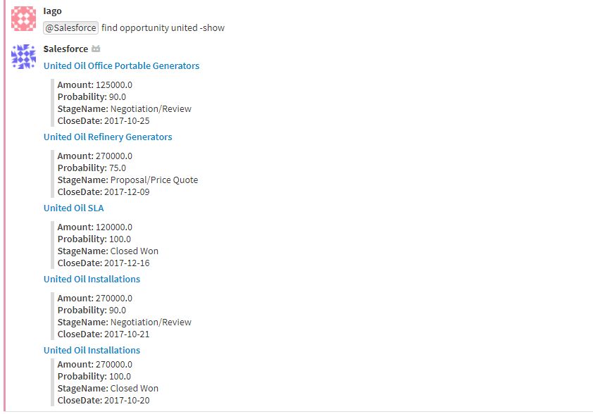

# Salesforce bot

The Salesforce bot can get records from your Salesforce database.
It can also show details about any Salesforce links that you post.

## Setup

1. Create a user in Salesforce that the bot can use to access Salesforce.
Make sure it has the appropriate permissions to access records.
2. In `salesforce.conf` paste the Salesforce `username`, `password` and
`security_token`.
3. Run the bot as explained [here](https://wyzepal.com/api/running-bots#running-a-bot)

## Examples

### Standard query

### Custom query

### Link details

## Optional Configuration (Advanced)

The bot has been designed to be able to configure custom commands and objects.

If you wanted to find a custom object type, or an object type not included with the bot,
like `Event`, you can add these by adding to the Commands and Object Types in `utils.py`.

A Command is a phrase that the User asks the bot. For example `find contact bob`. To make a Command,
the corresponding object type must be made.

Object types are Salesforce objects, like `Event`, and are used to tell the bot which fields of the object the bot
should ask for and display.

To show details about a link posted, only the Object Type for the object needs to be present.

Please read the
[SOQL reference](https://goo.gl/6VwBV3)
to make custom queries, and the [simple_salesforce documentation](https://pypi.python.org/pypi/simple-salesforce)
to make custom callbacks.

### Commands

For example: "find contact tim"

In `utils.py`, the commands are stored in the list `commands`.

Parameter | Required? | Type | Description | Default
--------- | --------- | ---- | ----------- | -------
commands | [x] | list[str] | What the user should start their command with | `None`
object | [x] | str | The Salesforce object type in `object_types` | `None`
query | [ ] | str | The SOQL query to access this object* | `'SELECT {} FROM {} WHERE Name LIKE %\'{}\'% LIMIT {}'`
description | [x] | str | What does the command do? | `None`
template | [x] | str | Example of the command | `None`
rank_output | [ ] | boolean | Should the output be ranked? (1., 2., 3. etc.) | `False`
force_keys | [ ] | list[str] | Values which should always be shown in the output | `[]`
callback | [ ] | callable** | Custom handling behaviour | `None`

**Note**: *`query` must have `LIMIT {}` at the end, and the 4 parameters are `fields`, `table` (from `object_types`),
`args` (the search term), `limit` (the maximum number of terms)

**`callback` must be a function which accepts `args: str`(arguments passed in by the user, including search term),
`sf: simple_salesforce.api.Salesforce` (the Salesforce handler object, `self.sf`), `command: Dict[str, Any]`
(the command used from `commands`)

### Object Types
In `utils.py` the object types are stored in the dictionary `object_types`.

The name of each object type corresponds to the `object` referenced in `commands`.

Parameter | Required? | Type | Description
--------- | --------- | ---- | -----------
fields* | [x] | str | The Salesforce fields to fetch from the database.
name | [x] | str | The API name of the object**.

**Note**: * This must contain Name and Id, however Id is not displayed.
** Found in the salesforce object manager.
